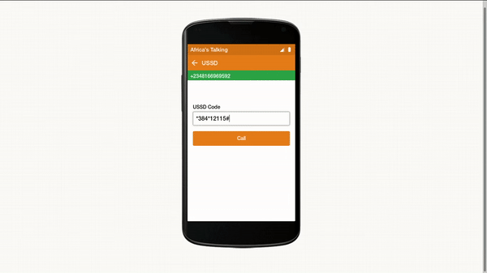

# REPOTA USSD CLIENT

The USSD Client for the Repota Citizen Safety App


## Setup

- Once you've linked your phone number and twitter username, you can report an issue using the USSD interface
- This data is collected and streamed to relevant security authorities and blasted using the repota-twitter-bot
- Install node.js version ver >8.x.x (this demo runs with ES6 language features)
- Install mysql (create user root, and database)

### Create a .env file at the root of the project with the following configs

```env
PORT=

AT_USERNAME=
AT_APIKEY=

DB_HOST=
DB_NAME=
DB_USER=
DB_PASS=

HOUNDIFY_CLIENTID=
HOUNDIFY_CLIENTKEY=
HOUNDIFY_USERID=
```

### Install Node Modules and start the app

```bash
$ npm install
$ npm start
```

### Routes

- Routes are under routes folder (sms, ussd, voice)
- they are mapped by app.js (look at the route imports)
